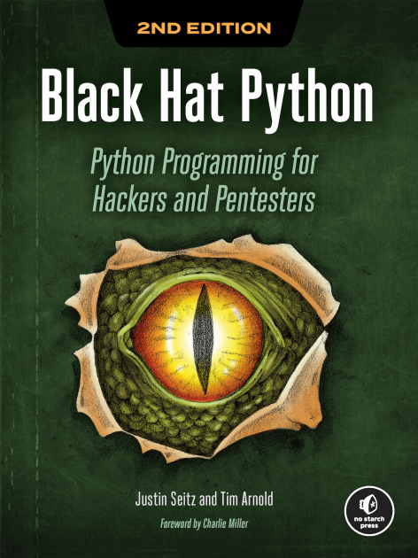

# Black Hat Python

## Summary

This repository contains all the code found in the book "[Black Hat Python](https://nostarch.com/black-hat-python2E "Black Hat Python book on No Starch Press website")" written by [Justin Seitz](https://twitter.com/jms_dot_py "Justin Seitz Twitter Profile") and Tim Arnold.

---

## Contents

* [Chapter 2 - Basic Networking Tools](./Chapter02/ "Code for chapter 2")

* [Chapter 3 - Writing a Sniffer](./Chapter03/ "Code for chapter 3")

* [Chapter 4 - Owning the Network with Scapy](./Chapter04/ "Code for chapter 4")

* [Chapter 5 - Web Hackery](./Chapter05/ "Code for chapter 5")

* [Chapter 6 - Extending Burp Proxy](./Chapter06/ "Code for chapter 6")

* [Chapter 7 - GitHub Command and Control](./Chapter07/ "Code for chapter 7")

* [Chapter 8 - Common Trojan Tasks on Windows](./Chapter08/ "Code for chapter 8")

* [Chapter 9 - Fun with Exfiltration](./Chapter09/ "Code for chapter 9")

* [Chapter 10 - Windows Privilege Escalation](./Chapter10/ "Code for chapter 10")

* [Chapter 11 - Offensive Forensics](./Chapter11/ "Code for chapter 11")
